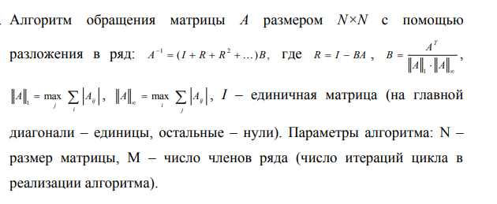

#Векторизация вычислений 

Написать три варианта программы, реализующей алгоритм:

1. Вариант без векторизации.

2. Вариант с ручной векторизацией.

3. Вариант с матричными операциями, выполненными с использованием оптимизированной 
библиотеки BLAS.
